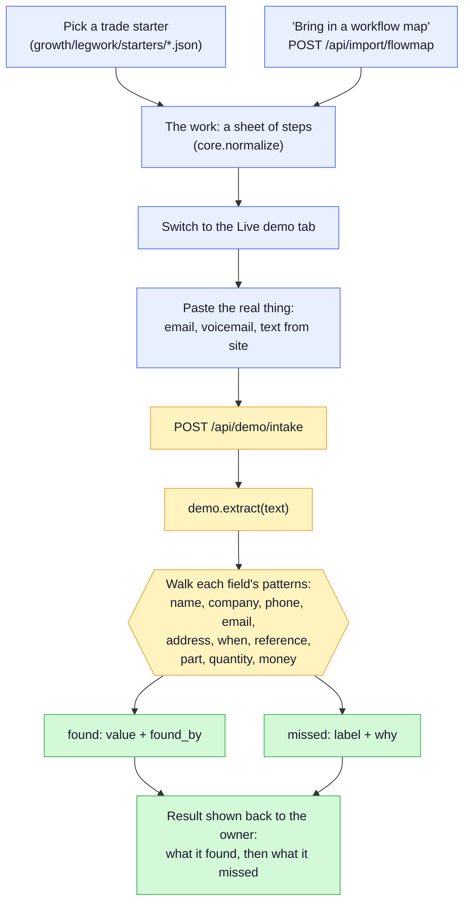

# Legwork

Sit down with somebody who runs a business, and in ten seconds have a workflow
they recognise on the screen — then paste in their actual mess and watch real
extraction happen in front of them.

[](https://www.python.org/)
[](#layout)
[](run_all_tests.py)
[](https://github.com/blaine-hiers/Legwork/actions/workflows/ci.yml)
[](LICENSE)

It is not a slideshow. The same code runs on whatever gets pasted in, including
an email the owner opens themselves in front of you. That is the entire point.

## Quickstart

```bash
py growth/legwork/app.py          # opens in your browser
py run_all_tests.py               # 102 tests
```

Windows: double-click `run.cmd`.

| Command | Flag | Does |
|---|---|---|
| `py growth/legwork/app.py` | `-v` | Say what the server is doing as it starts. |
| `py run_all_tests.py` | `-v` | Show each test name, not just the totals. |
| `py run_all_tests.py <filter>` | — | Only run test files whose path matches `<filter>` (the test tree mirrors the app tree). |
| `run.cmd` | `-v` | Same as the server's `-v`, for the double-click path. |

No dependencies, no installer, no network. Standard library only.

## How a session flows

The two-phase shape: map the owner's workflow first, then run real extraction
on whatever they paste in. Nothing pasted into the live demo leaves the
machine — there is no network call in this path at all.



Field extraction (`growth/legwork/demo.py`) is regular expressions in the
standard library — no model, no cloud. Each field also reports `found_by`
(which pattern matched) and every miss carries a reason, because a demo that
only shows its wins is a demo that gets believed once.

## The two halves

**The sheet.** Pick a trade and a workflow appears, already populated with
steps somebody in that trade would recognise. Every step is scored by what
happens to the *information* in it — typed in twice, hunted for, written down
again, chased, on paper, checked, scheduled, decided. Each of those has a
pattern behind it that knows what the automated version looks like and what
it takes off the step.

**The live demo.** Paste the real thing. It pulls the fields out, writes the
work order, or lists what is late with the follow-up already drafted.

## Three things are enforced in code, not promised

> **No saving is ever a single figure.** This is the load-bearing design
> decision in this app, not a style choice.

Patterns compose by what each one leaves for the next rather than adding up,
every step is squeezed by a ceiling so nothing can read as 100%, and a guard
raises the range rather than letting it collapse to a point.

**Nothing turns into money unless you state an hourly cost.** A dollar figure
on an invented rate is a guess with a dollar sign on it.

**One of the eight patterns says no.** A judgement call stays with the person.
That is what makes the other seven credible in the room — a tool where
everything is automatable is a tool nobody believes.

The demo also reports **what it could not find** beside what it found, and
says out loud that it catches missing and malformed fields but never *wrong*
ones.

## The starters are files, not code

`growth/legwork/starters/*.json` — one file per trade, edited in a text
editor. Adding a file adds a starter; there is nothing to register.

That matters more than it sounds. The rule these serve is that every
conversation happens in the other person's vocabulary, and "when they use a
different word, change the template" only actually happens if changing it
doesn't mean editing Python.

A starter file **cannot carry a volume** — `runs_per_month` is forced to zero
and the attempt is reported on screen, because how often something runs is
theirs to say, not the template's to assume. A broken file is dropped with its
reason on the screen rather than in a log.

Sample data in the starters uses `.example` domains, which are reserved by
RFC 2606 and can never resolve.

## Layout

```
_shared/           server, storage and design system (vendored — see below)
growth/legwork/    the app
tests/             102 tests, mirroring the app tree
```

`_shared/` is vendored from a larger private workspace of about twenty of
these apps that share one server base, one storage layer and one visual
language. The two-level `growth/…` path is not decoration: the folder an app
sits in decides its colour, and the test tree mirrors the app tree exactly.
Its comments occasionally mention sibling apps that are not in this repo.

`tests/test_publishable.py` guards the seam between that private workspace and
this one — it fails if a copied file brings private fixture data back with it.

## Licence

MIT. See [`LICENSE`](LICENSE).
